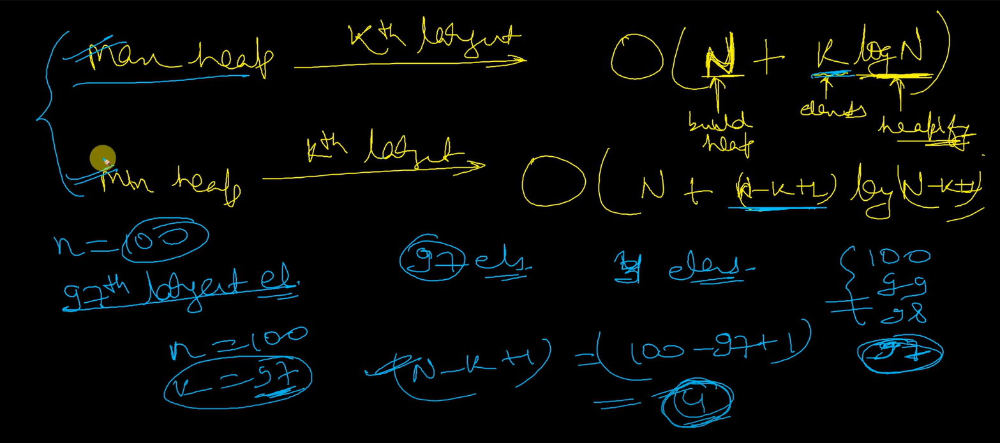
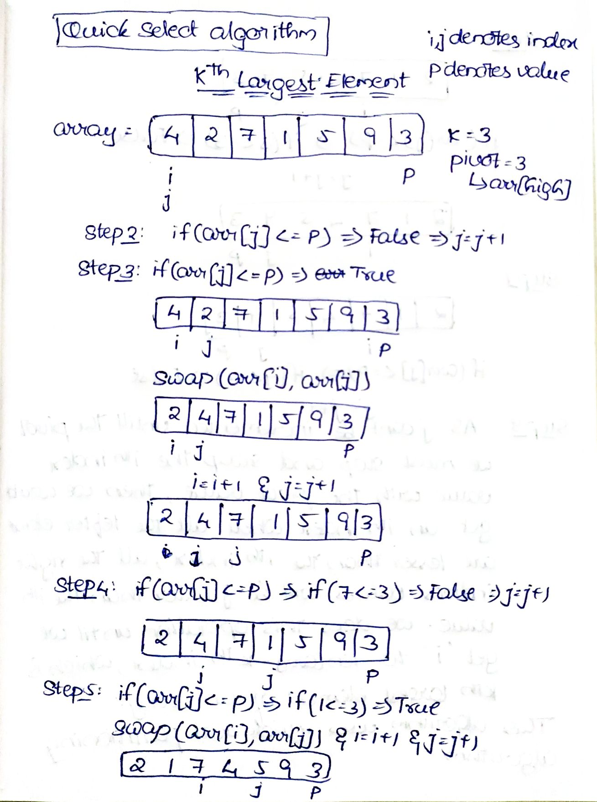
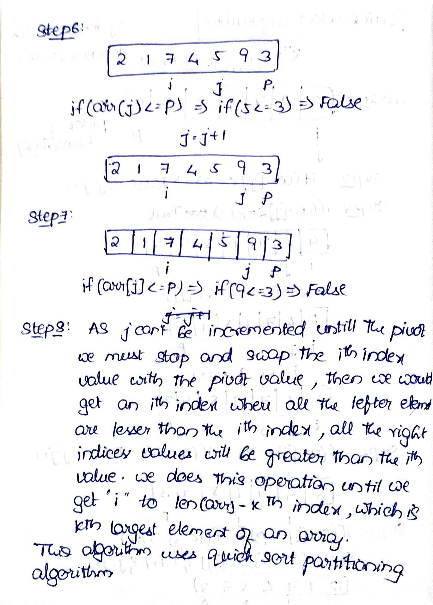

# Kth Largest Element in an array

We will be discussing various methods to find Kth Largest Element of the array

## Method 1

* First we need to sort the array using merge sort
* And then return the (n-K)th element of the sorted array
* And if we want to return Kth minimum element of array return the (K-1)th element
* Time complexity of this method , is for performing merge sort it takes O(NlogN) and for retrieving some xth element it takes O(1) time , so the overall complexity is O(NlogN)

## Method 2

* While we are using max heap , we need to return the kth retrival of the max heap tree , which will be already sorted in decending order , but if we wanted to acheive the same with the min heap , we need to retrieve (n-k+1)th element of the min heap tree.

* If we use max heap to find Kth largest element , then we would require O(N) time for building a heap and after pulling out top most element which is largest from the heap , we need to re-heapify the array , which would take logN times , and we does this re-heapification K times , as we gonna re-heap K times and pull the top most element from the heap. Overall It would take O(N+KlogN)
* If we use min heap for finding Kth largest element , it would take O(N+(N-K+1)log(N-K+1)) , because we do remove element and re-heapify N-K+1 times , as we need to remove the N-K+1 elements from the first to get the Kth Largest element using min-heap.
* The usage of max heap and min heap entirely depends on the value of K , if the value of K is greater than half of the array elements then , finding Kth largest element will be optimal to do by using min heap.
* For example , if we want to find 90th largest element in 100 element array , if we solve it using max heap then we need to pop out 89 elements from the max heap and heapify 89 times and select 90th element of max heap. 
* So , rather than that , it is preferable to select (100-90+1)th element of min heap , which only takes 10 removal and 10 heapifications and return the 11th element.

## Method 3 (Quick Select Method)

The purpose of the partition function is to rearrange the elements of the array such that all elements less than or equal to the pivot are placed before it, and all elements greater than the pivot are placed after it. This process is known as partitioning.

Here’s a step-by-step breakdown of how the partition function works:

* The function takes three parameters: arr, low, and high. 
* arr is the input array, and low and high define the range of indices to consider.
* A pivot element is selected from the array. 
* In this implementation, the pivot is chosen as the last element (arr[high]).
* The function initializes an index i to low.
* The function iterates over the range from low to high - 1 using a variable j.
* For each element arr[j], if it is less than or equal to the pivot, it swaps arr[i] with arr[j] and increments i. 
* This ensures that all elements less than or equal to the pivot are moved to the left side of the partition.
* Finally, the pivot element is swapped with arr[i], placing it at its correct sorted position.
* The function returns the index of the pivot element.
* The purpose of this partitioning step is to divide the array into two parts: 
    * one with elements less than or equal to the pivot, and another with elements greater than the pivot.
    * This allows for efficient selection of elements based on their relative order.

In this example, we have an array arr with the values [4, 2, 7, 1, 5, 9, 3] and we want to find the 3rd largest element.

* Here’s how the kth_largest_element function works step by step:
* The initial values of low and high are set to 0 and len(arr) - 1, respectively.
* The while loop starts and continues until the condition is met.
* The partition function is called with the current values of low and high. 
* It selects a pivot element and partitions the array around it.
* If the pivot index (pivot_index) is equal to len(arr) - k, we have found the Kth largest element. 
* In this example, if pivot_index is equal to 7 - 3 = 4, we have found the 3rd largest element.
* If the pivot index is greater than len(arr) - k, we update high to be pivot_index - 1. 
* This means that the Kth largest element is in the left partition of the array.
* If the pivot index is less than len(arr) - k, we update low to be pivot_index + 1. 
* This means that the Kth largest element is in the right partition of the array.
* The loop continues until the condition is met, and finally, we return the Kth largest element.
* In our example, the output will be 5, as it is the 3rd largest element in the array.

This is a glimpse of one pivot movement using the partition algorithm that we discussed above.

